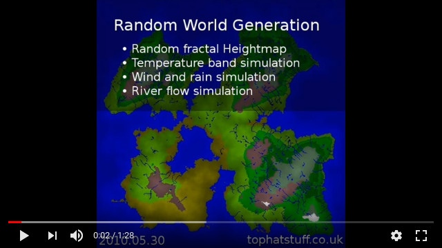
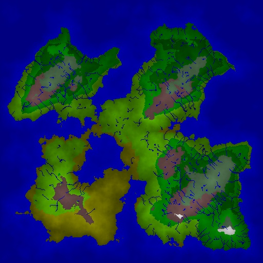
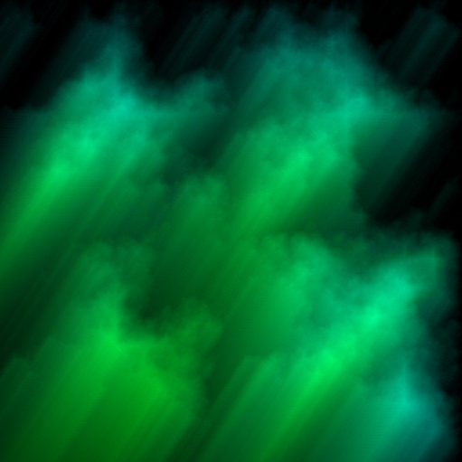
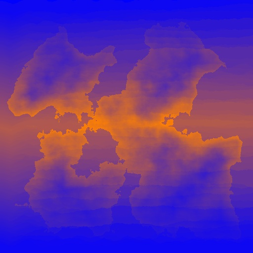
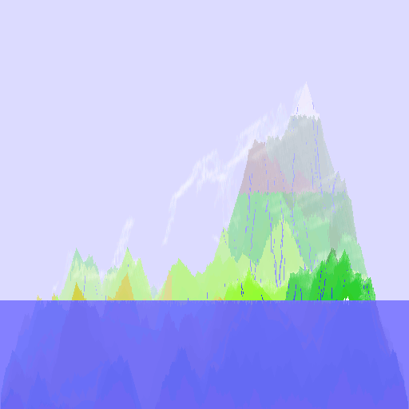

[Hero Extant World Generator 2010](http://www.tophatstuff.co.uk/index.html@p=99.html)
====================================================================

This program has a random world generator that exports easy to read data. You
may like to use it to generate maps for your own projects. Worlds are saved as
binary and also rendered as PNG images. You can find saved worlds in the
"local" folder and information on how to read the data in the "docs" folder.

Source
------

The code is written in a Pascal-like language called Cobra (not the .NET language
with the same name). The code is now (2017) public domain.

**Compilers for this language no longer exist.**

Hero Extant (2010) has also been [ported to Java](https://github.com/avh4/hero-extant).

Binaries
--------

[This repository](https://github.com/golightlyb/hero-extant-2010) contains
source code and Windows binaries. You can get a copy of this from
[Hero Extant in the TopHat Stuff archive](http://www.tophatstuff.co.uk/index.html@p=99.html).

Video
-----

Example Output
--------------

### Rendered Final Map

### Terrain Types

### Terrain Contiguity

### Wind and Rain Simulation

### Temperature Simulation

### Experimental feature: using wind & rainfall data to render clouds.

