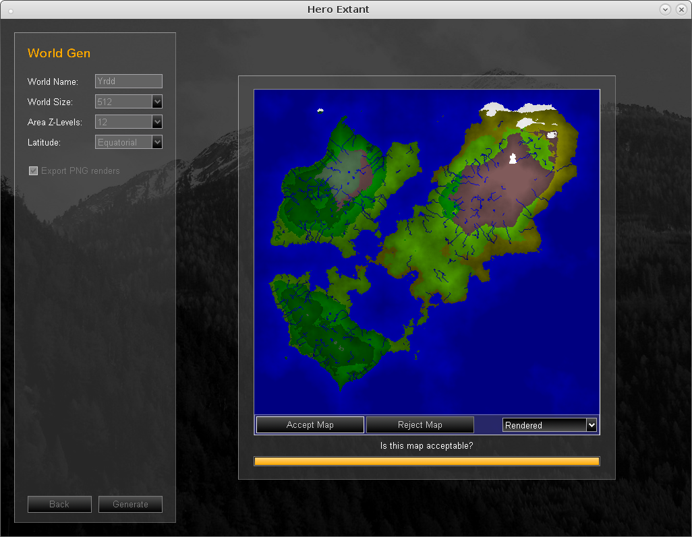

[Hero Extant World Generator 2010](http://www.tophatstuff.co.uk/index.html@p=99.html)
====================================================================

This program has a random world generator that exports easy to read data. You
may like to use it to generate maps for your own projects. Worlds are saved as
binary and also rendered as PNG images. You can find saved worlds in the
"local" folder and information on how to read the data in the "docs" folder.

The code is written in a Pascal-like language called Cobra (not the .NET language
with the same name). Compilers for this language no longer exist.

[This repository](https://github.com/golightlyb/hero-extant-2010) contains
source code. You can get binaries from
[Hero Extant in the TopHat Stuff archive](http://www.tophatstuff.co.uk/index.html@p=99.html)

